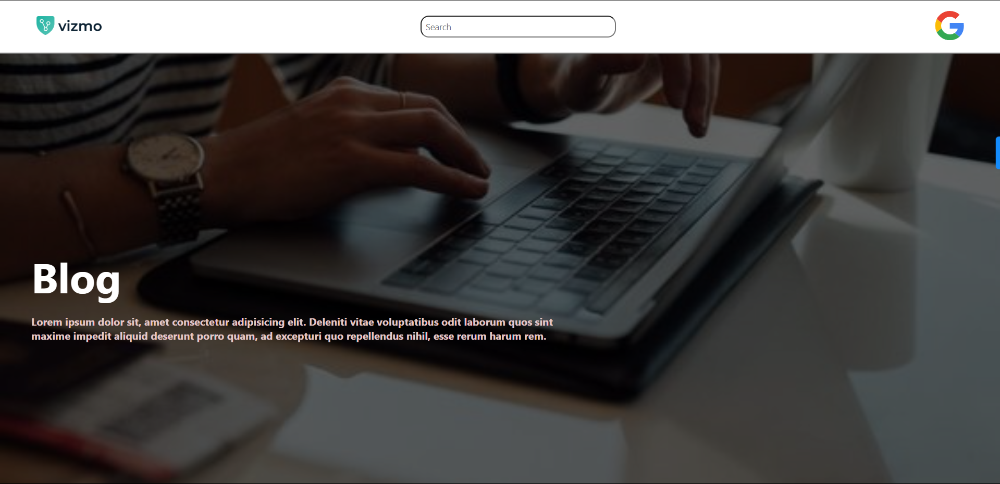
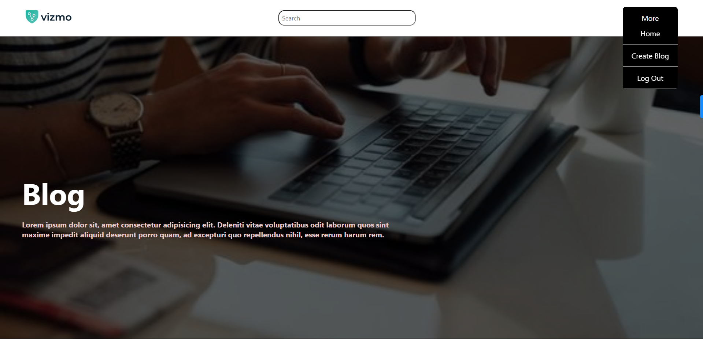
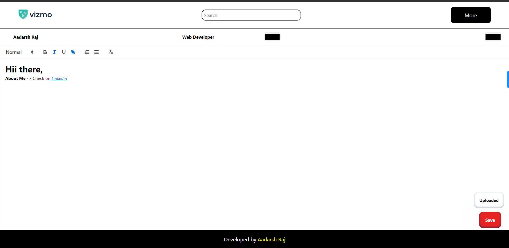
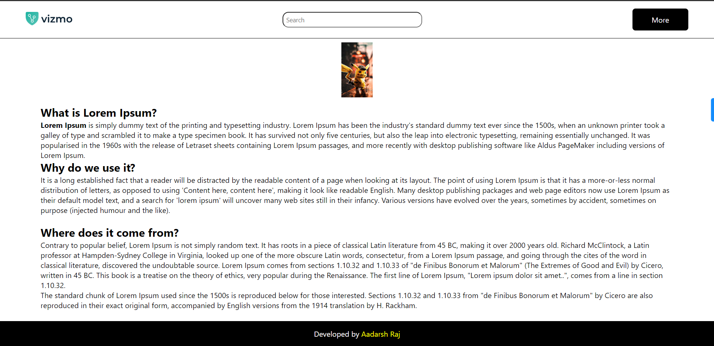

Welcome to the Blog Poster Website! This platform offers a comprehensive solution for blogging enthusiasts and writers who wish to share their thoughts and ideas with a broad audience. Our website features a robust authentication system and a user-friendly blog posting interface, ensuring a secure and seamless experience for all users.
 
 

## Features
- User Authentication: Secure login and registration process to keep user data safe.
- Blog Posting: Easily create and publish blog posts with our intuitive editor.
- Awesome UI: Experience a clean, modern, and responsive user interface designed for maximum engagement and ease of use.
- Rich Text Editor: Utilize our powerful editor to format your content with various styles, images, and other multimedia elements.
 
 

## Getting Started
To start using the Blog Poster Website, simply log in with your existing google account throught the given link. Once authenticated, you can immediately start writing and publishing your blog posts.
 
Link -> [Click Here](https://main--arya-blog-poster.netlify.app/)
   

Enjoy a seamless blogging experience with our feature-rich platform designed to enhance your writing journey!

   

## Website UI

Developed by [Aadarsh Raj](https://www.linkedin.com/in/aadarsh-raj-80b862216/)